# Advanced Continuous Delivery (CD)

This page presents advanced Continuous Delivery considerations for projects/products that need to be **hosted** and **deployed** in server environments.

- Do you use **Review Apps**?
    - If not, why?
    - What are the impacts?
    - Are there alternatives?
- Do you use a pull-based deployment strategy (**GitOps**)?
    - What are the impacts?
- Where do you manage your **deployment code** (ex: Ansible, Helm, Kubernetes, AWS CloudFormation, Azure Bicep...)?
    - In the same repo than the application code? Somewhere else?
    - What are the impacts?

## Review Apps

Review Apps are dynamic and ephemeral environments to deploy your _ongoing developments_ (a.k.a. _feature_ or _topic_ branches).

### Why you should consider using Review Apps

Review Apps are a tremendous enabler for quality and agility as they allow to deploy and test your code very early in the development lifecycle. They are also a natural enabler for running automated acceptance tests.

In practice, using Review Apps will increase your confidence in the changes you're merging into the
codebase and allows you to consider doing without an integration environment and therefore simplify
your workflow to something very lean and efficient (consider the [feature-branch](understand.mdevelopment-workflow) branching model or similar).

### Possible reasons for not using Review Apps

- [Can't afford review environments](understand.mdant-afford-review-environments)
- [Not mature enough for Continuous Delivery](understand.mdot-mature-enough-for-continuous-delivery)
- [Release-oriented delivery](understand.mdelease-oriented-delivery)

### Consequences of not using Review Apps

- Not using Review Apps will probably lead you to adopting a Gitflow branching model (with an integration environment) that we consider [unnecessarily complex and inefficient](understand.mdhen-to-use-gitflow).
- Implementing automated acceptance tests in the early development stages (during the Merge Request) can be challenging without Review Apps (see below).

### :bulb: An alternative to automate acceptance tests

If your application is **containerized** and if you're able to run it **standalone** (mocking and stubbing the external dependencies), you can consider [running your application as a service container](https://docs.gitlab.com/ci/services/) in your acceptance test job, and run your tests on it.

Example with Docker + Cypress templates:

```yaml
include:
  # Docker template
  - component: $CI_SERVER_FQDN/to-be-continuous/docker/gitlab-ci-docker@6.1
  # Cypress template
  - component: $CI_SERVER_FQDN/to-be-continuous/cypress/gitlab-ci-cypress@3.9
    inputs:
      review-enabled: true

# override the Cypress job to run the app as a service
cypress:
  services:
    # reuse the variable for the snapshot image (from Docker template)
    - name: "$DOCKER_SNAPSHOT_IMAGE"
      alias: "myapp"
      # pass any required options to run your app in standalone
      command: ["--dev"]
  variables:
    # set $environment_url to run against the service container
    environment_url: "http://myapp
```

Otherwise you may consider acceptance tests will only be run against the integration environment (that means later in your development workflow: only once your changes have been merged to your integration branch).

## Pull-based deployment & GitOps

GitOps has become a popular deployment strategy that relies on two strong principles:

1. Git repository as the **single source of truth** for the deployment state (_hence the name_): your entire infrastructure is described
  as declarative files in one or several Git repositories.
2. **Pull-based deployment**: adopting the GitOps strategy, the base deployment technique becomes a (Git) push into a source repository (or registry).
  Then the rest of the process is **fully asynchronous**: your GitOps operator will soon or late notice the desired state has _derived_ (no longer matches the actual state) and will try to reconcile the actual state with the desired state.
  You have no clue when this will occur, when it terminates and whether if succeeded or failed.

:information_source: GitOps is usually used in conjunction with containerization technologies such as **Kubernetes**.

### Consequences of pull-based deployment

Let's consider the following CI/CD pipeline:

```mermaid
---
title: CI/CD with push-based deployment
config:
  look: handDrawn
  theme: neutral
---
flowchart LR
  subgraph CI[continuous integration]
    build([Build])
    test([Unit Tests])
    sast(["SAST (security scan)"])
  end
  subgraph CD[continuous deployment]
    staging(["Deploy (staging) ✋⏳"])
    acceptance(["Functional Tests"])
    perf(["Performance Tests"])
    dast(["DAST (pentest)"])
    prod(["Deploy (production) ✋⏳"])
  end

  build --> test
  build --> sast
  test --> staging
  sast --> staging
  staging --> acceptance
  staging --> perf
  staging --> dast
  acceptance --> prod
  perf --> prod
  dast --> prod

  classDef stage fill:none,stroke:#eee,color:#888,font-weight:bold,font-style:italic,stroke-width:5px;
  classDef pill fill:#ddd,stroke:#555,color:#000;
  classDef deploy fill:#ea707040,stroke:#ea7070,color:#000;
  class CI,CD,acc stage
  class build,test,sast,acceptance,perf,dast,otherci pill
  class staging,prod deploy
```



Implementing this based on a **push-based deployment** technique is trivial because it is natively **synchronous**, and the deployment task
will wait for the command to return successfully (and continue the pipeline execution) or fail (and therefore fail and stop the pipeline execution).

On the contrary, it is highly difficult to implement the same based on a **pull-based deployment** technique because - while triggering the deployment can be executed with the appropriate command - the technique is fundamentally **asynchronous** and there's no easy way of waiting for the deployment to succeed (or fail). Sadly, there is no simple way of orchestrating this valuable continuity in your deployment workflow:

- Whenever my staging environment is successfully deployed, I want to launch several tests. 
- If they succeed, I want to deploy to prod (or why not publish a new _candidate release_ version of my app in an OCI registry).

### :bulb: Keep a push-based deployment for non-prod environments

In order to mitigate this drawback and preserve the value of a single pipeline orchestrator controlling both CI and CD, our advice is to keep a **push-based deployment technique for non-prod environments**.

This is doable as GitOps usually relies on technologies that allow push-based deployment (`kubectl apply` with Kubernetes or `helm update` with Helm).

In other words, you would use the push-based deployment technique for your review environments, integration environment (if any), staging environment, and the final deliverable of your project pipeline would be a versioned package of your application, published to an OCI registry. This is what we call the [Software Distribution](understand.mdoftware-distribution-delivery) delivery. The package will then continue its life independently of the repository, and will be promoted to further environments, managed in the GitOps way.

Another possible way of implementing push-based deployment from the application pipeline is by [triggering a remote pipeline](https://docs.gitlab.com/ci/triggers/) on the deployment project.

While publishing a new versioned package, you might also want to implement a final job that triggers the GitOps deployment by Git committing/pushing the version of the newly published artifact
(:information_source: the [GitOps template](../ref/gitops/) can be used for this).

The resulting CI/CD pipeline would look like this:

```mermaid
---
title: Recommended CI/CD pipeline for GitOps
config:
  look: handDrawn
  theme: neutral
---
flowchart LR
  subgraph CI[continuous integration]
    build([Build])
    test([Unit Tests])
    sast(["SAST (security scan)"])
  end
  subgraph CD[continuous delivery]
    staging(["Deploy (staging)<br><i><b>⚠ push-based ⚠</b></i>"])
    acceptance(["Functional Tests"])
    perf(["Performance Tests"])
    dast(["DAST (pentest)"])
    publish(["Release"])
    trigger(["GitOps trigger 🗲<br><i><b>optional</b></i>"])
  end

  registry[(<u>Container Registry</u><br/><code>📦 app:1.0.0</code><br/><code>📦 app:main-latest</code>)]

  build --> test
  build --> sast
  test --> staging
  sast --> staging
  staging --> acceptance
  staging --> perf
  staging --> dast
  acceptance --> publish
  perf --> publish
  dast --> publish

  publish -.publish 📦.-> registry
  publish --> trigger

  classDef stage fill:none,stroke:#eee,color:#888,font-weight:bold,font-style:italic,stroke-width:5px;
  classDef pill fill:#ddd,stroke:#555,color:#000;
  classDef pill_opt fill:#70ea7040,stroke:#70ea70,color:#000;
  classDef deploy fill:#ea707040,stroke:#ea7070,color:#000;
  class CI,CD,acc stage
  class build,test,sast,acceptance,perf,dast,otherci pill
  class staging,publish deploy
  class trigger pill_opt
```



## Where to manage the deployment code?

There is no prefered/recommended strategy between choosing to have the deployment code in the same repository as the application code or not. It's mostly a matter of choice and organization.

### Possible reasons for your choice

- not the same team/people working on the deployment code and on the application code,
- will to decouple the deployment logic from the application, each with its own independent lifecycle and versioning,
- a GitOps deployment strategy will tend to separate them (see [previous chapter](#pull-based-deployment--gitops)).

### Consequences of deployment code in a separate repo

While implementing continuous deployment is trivial when deployment code and application code are in the same repository, the reverse raises some challenges:

- How do you trigger the deployment from the application repository to automate deployment to your non-production environments?
- How do you update the environments when working on deployment code changes?

### :bulb: Recommended design with deployment code in a separate repo

In order to address the above challenges, we recommend to following:

- The deployment code repository implements a [Software Distribution](understand.mdoftware-distribution-delivery) delivery, ultimately publishing versioned packages of itself (ex: Helm charts, Kubernetes templates, Terraform template...) to an appropriate registry.
- The application code repository is free to use whichever [delivery mode](understand.mdelivery-modes), but every deployment job uses some pinned version of the deployment code, retrieved from the packages registry.
- When a new version of the deployment code is made available (release), its version has to be updated in the application code repository.

```mermaid
---
title: Deployment code in a separate repository
config:
  look: handDrawn
  theme: neutral
---
flowchart LR
  subgraph iac[deployment code pipeline]
    iac-build([Build])
    iac-ellipsis([…])
    iac-publish(["Publish"])
  end
  subgraph app[application code pipeline]
    app-build([Build])
    app-test([Tests & Analysis<br/>…])
    staging(["Deploy<br/>(staging)"])
    acceptance(["Acceptance Tests<br/>…"])
    prod([…])
  end
  registry[(Packages Registry<br/><code>📦 iac:1.0.0</code><br/><code>📦 iac:1.1.0</code>🌟)]

  iac-build --> iac-ellipsis --> iac-publish
  iac-publish -- new version🌟<br/><code>📦 iac:1.1.0</code>--> registry
  app-build --> app-test --> staging --> acceptance --> prod
  staging -."uses <code>📦 iac:1.0.0</code>".-> registry

  classDef group fill:none,stroke:#eee,color:#888,font-weight:normal,font-style:italic,stroke-width:5px;
  classDef pill fill:#ddd,stroke:#555,color:#000;
  classDef empty fill:#fff,stroke:none,color:#000;
  classDef registry fill:#ea707040,stroke:#ea7070,color:#000;
  class iac,app group
  class iac-build,iac-publish,iac-ellipsis,app-build,app-test,staging,acceptance,prod pill
  class registry registry
```


